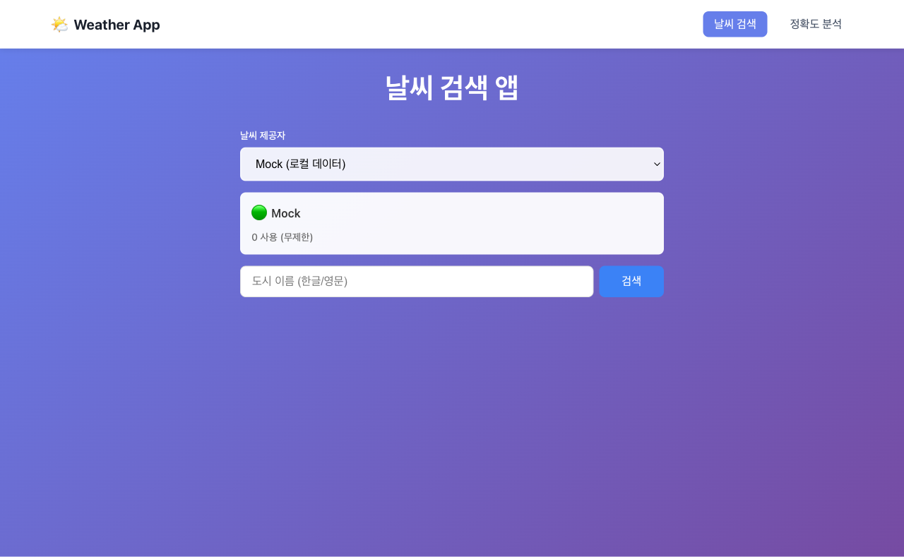
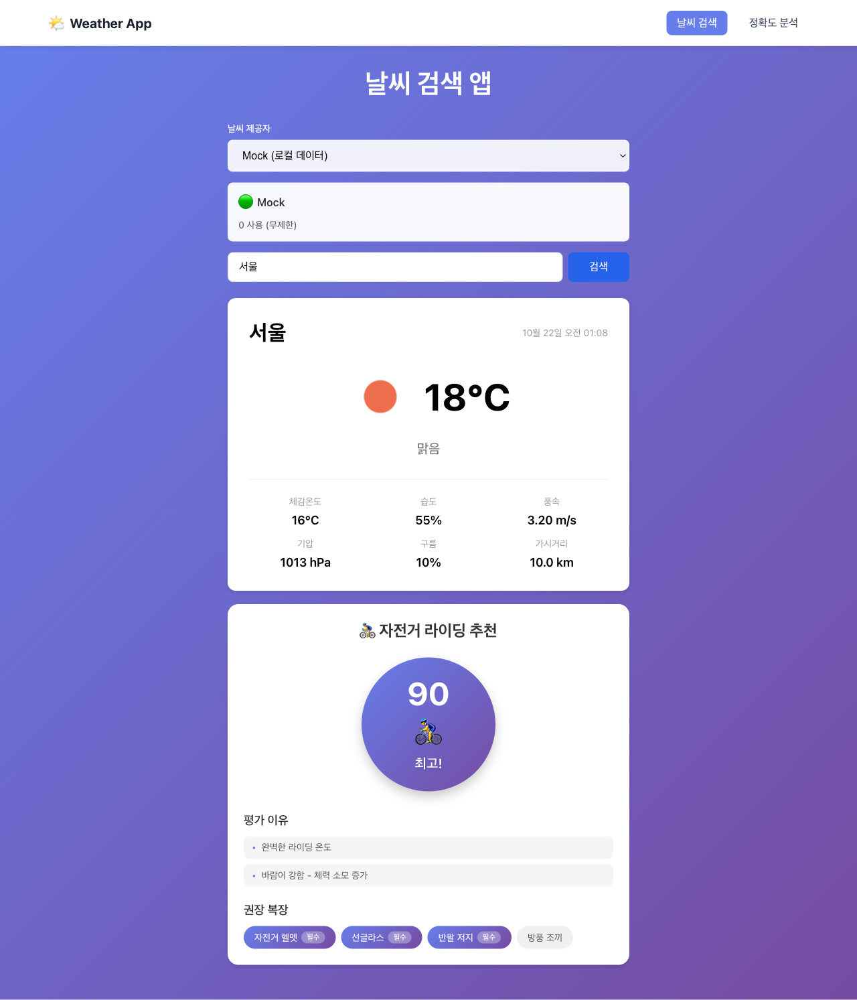
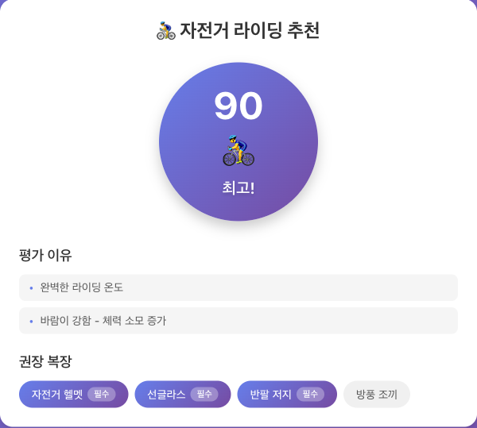
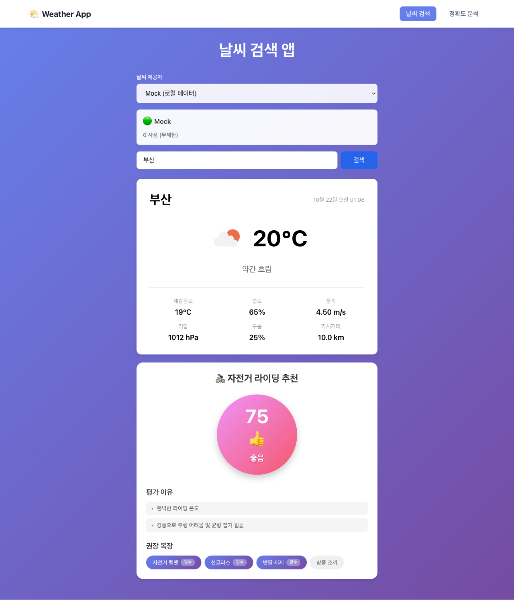
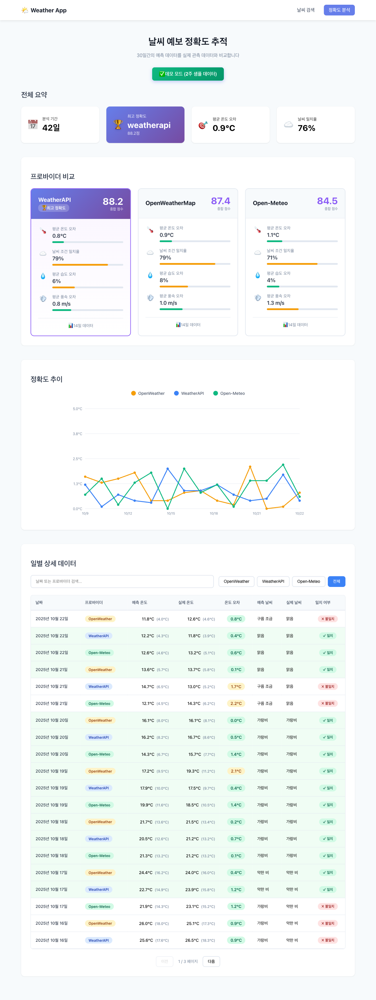
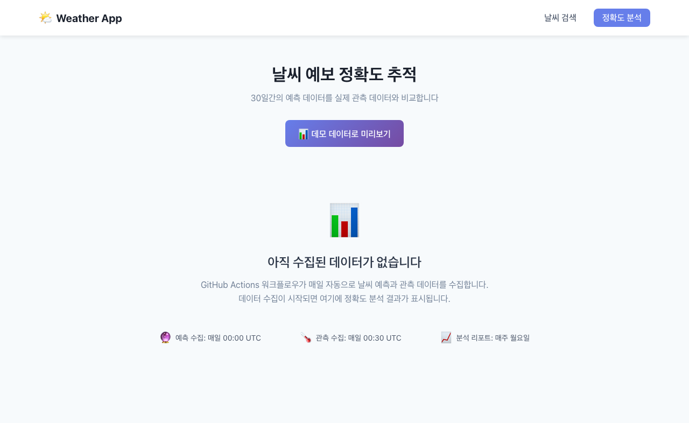
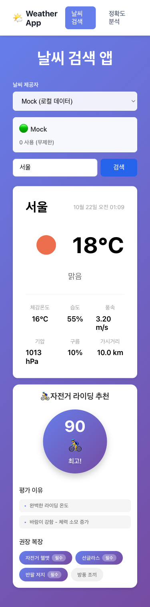

# 프로젝트 2: 날씨 검색 앱

## 📋 프로젝트 개요

**난이도**: ⭐⭐ 초중급  
**개발 시간**: 2-3일  
**Playwright 학습 효과**: ⭐⭐⭐  
**실무 유사도**: ⭐⭐⭐

## 📸 프로젝트 스크린샷

### 1. 초기 화면


### 2. 서울 날씨 검색 결과 - 자전거 추천 포함 (Phase 7)


### 3. 자전거 추천 상세 화면


### 4. 부산 날씨


### 5. Provider 선택 UI


### 6. Quota Status 표시


### 7. 정확도 추적 페이지 - 데모 데이터 미리보기 (Phase 6)
데이터가 없을 때 "📊 데모 데이터로 미리보기" 버튼을 클릭하면 2주간의 샘플 데이터를 확인할 수 있습니다.



### 7-2. 정확도 추적 페이지 - 실제 데이터


### 8. 모바일 화면 - 초기


### 9. 모바일 화면 - 날씨 결과


### 10. 에러 상태


## 🎯 학습 목표

이 프로젝트를 통해 다음을 학습합니다:
- API 모킹 (route.fulfill)
- 네트워크 요청 대기 (waitForResponse)
- 로딩 상태 테스트
- 에러 핸들링 검증

## 🛠 기술 스택

- **Frontend**: Vue 3 + TypeScript + Vite
- **API**: OpenWeatherMap API
- **상태 관리**: Pinia
- **스타일링**: CSS Modules

## ✨ 주요 기능 요구사항

### 1. 도시 이름 입력 및 검색
- 검색 입력 필드 제공
- Enter 키 또는 검색 버튼으로 검색 실행
- 한글/영문 도시 이름 지원
- 검색 이력 저장 (LocalStorage)

### 2. 현재 날씨 표시
- **온도**: 섭씨(°C) 표시
- **체감 온도**: Feels like 온도
- **습도**: 백분율(%)
- **풍속**: m/s 또는 km/h
- **날씨 상태**: 맑음, 흐림, 비, 눈 등
- **날씨 아이콘**: API 제공 아이콘 사용

### 3. 5일 예보
- 3시간 간격 예보 데이터 표시
- 날짜별로 그룹화
- 최고/최저 온도 표시
- 간단한 그래프 또는 차트 (선택사항)

### 4. 로딩 상태 표시
- API 요청 중 로딩 스피너 표시
- 스켈레톤 UI (선택사항)
- 로딩 중 입력 필드 비활성화

### 5. 에러 처리
- **도시 없음** (404): "도시를 찾을 수 없습니다"
- **네트워크 오류**: "네트워크 오류가 발생했습니다"
- **API 키 오류** (401): "API 키가 유효하지 않습니다"
- **일반 오류**: "오류가 발생했습니다. 다시 시도해주세요"

## 🎨 UI/UX 요구사항

### 레이아웃
```
┌────────────────────────────────────────┐
│  날씨 검색 앱                           │
├────────────────────────────────────────┤
│  [도시 이름 입력.........] [검색]       │
├────────────────────────────────────────┤
│  ┌──────────────────────────────────┐  │
│  │  서울                             │  │
│  │  ☀️ 맑음                          │  │
│  │  온도: 15°C (체감: 13°C)          │  │
│  │  습도: 60% | 풍속: 3.5 m/s        │  │
│  └──────────────────────────────────┘  │
├────────────────────────────────────────┤
│  5일 예보                               │
│  ┌────┬────┬────┬────┬────┐           │
│  │ 월 │ 화 │ 수 │ 목 │ 금 │           │
│  │15°C│17°C│14°C│16°C│18°C│           │
│  │ ☀️ │ ☁️ │ 🌧️ │ ☁️ │ ☀️ │           │
│  └────┴────┴────┴────┴────┘           │
└────────────────────────────────────────┘
```

### 상태별 UI
- **대기 중**: 기본 화면
- **로딩 중**: 로딩 스피너
- **성공**: 날씨 정보 표시
- **오류**: 에러 메시지 표시

## 🌐 API 연동

### OpenWeatherMap API

#### 1. API 키 발급
- [OpenWeatherMap](https://openweathermap.org/api) 회원가입
- API Keys에서 무료 키 발급
- 환경 변수로 관리 (`.env` 파일)

#### 2. 현재 날씨 API
```
GET https://api.openweathermap.org/data/2.5/weather
  ?q={city name}
  &appid={API key}
  &units=metric
  &lang=kr
```

**응답 예시:**
```json
{
  "name": "서울",
  "main": {
    "temp": 15,
    "feels_like": 13,
    "humidity": 60
  },
  "weather": [
    {
      "main": "Clear",
      "description": "맑음",
      "icon": "01d"
    }
  ],
  "wind": {
    "speed": 3.5
  }
}
```

#### 3. 5일 예보 API
```
GET https://api.openweathermap.org/data/2.5/forecast
  ?q={city name}
  &appid={API key}
  &units=metric
  &lang=kr
```

## 🧪 Playwright 테스트 시나리오

### 1. 서울 날씨 검색 테스트
```typescript
test('서울 날씨 검색', async ({ page }) => {
  await page.goto('http://localhost:5173');
  
  // Mock API 응답
  await page.route('**/api.openweathermap.org/**', async route => {
    await route.fulfill({
      status: 200,
      contentType: 'application/json',
      body: JSON.stringify({
        name: '서울',
        main: { temp: 15, humidity: 60 },
        weather: [{ description: '맑음' }],
        wind: { speed: 3.5 }
      })
    });
  });
  
  // 도시 입력
  await page.fill('input[placeholder="도시 이름"]', '서울');
  await page.click('button:has-text("검색")');
  
  // 로딩 표시 확인
  await expect(page.locator('.loading')).toBeVisible();
  
  // 날씨 정보 표시 확인
  await expect(page.locator('text=서울')).toBeVisible();
  await expect(page.locator('text=15°C')).toBeVisible();
  await expect(page.locator('text=맑음')).toBeVisible();
});
```

### 2. 잘못된 도시 이름 처리 테스트
```typescript
test('잘못된 도시 이름 처리', async ({ page }) => {
  await page.goto('http://localhost:5173');
  
  // Mock 404 응답
  await page.route('**/api.openweathermap.org/**', async route => {
    await route.fulfill({
      status: 404,
      contentType: 'application/json',
      body: JSON.stringify({ message: 'city not found' })
    });
  });
  
  await page.fill('input[placeholder="도시 이름"]', 'InvalidCity');
  await page.click('button:has-text("검색")');
  
  // 에러 메시지 확인
  await expect(page.locator('.error')).toHaveText('도시를 찾을 수 없습니다');
});
```

### 3. 네트워크 요청 추적 테스트
```typescript
test('네트워크 요청 추적', async ({ page }) => {
  await page.goto('http://localhost:5173');
  
  // 네트워크 요청 대기
  const responsePromise = page.waitForResponse(
    response => response.url().includes('openweathermap.org') && response.status() === 200
  );
  
  await page.fill('input[placeholder="도시 이름"]', '부산');
  await page.click('button:has-text("검색")');
  
  const response = await responsePromise;
  const data = await response.json();
  
  // API 응답 데이터 검증
  expect(data.name).toBe('부산');
  expect(data.main.temp).toBeGreaterThan(-50);
});
```

### 4. 로딩 상태 테스트
```typescript
test('로딩 상태 표시', async ({ page }) => {
  await page.goto('http://localhost:5173');
  
  // 느린 응답 시뮬레이션
  await page.route('**/api.openweathermap.org/**', async route => {
    await new Promise(resolve => setTimeout(resolve, 1000));
    await route.fulfill({
      status: 200,
      contentType: 'application/json',
      body: JSON.stringify({
        name: '대구',
        main: { temp: 18, humidity: 55 },
        weather: [{ description: '흐림' }],
        wind: { speed: 2.1 }
      })
    });
  });
  
  await page.fill('input[placeholder="도시 이름"]', '대구');
  await page.click('button:has-text("검색")');
  
  // 로딩 표시 확인
  await expect(page.locator('.loading')).toBeVisible();
  
  // 로딩 중 버튼 비활성화 확인
  await expect(page.locator('button:has-text("검색")')).toBeDisabled();
  
  // 결과 표시 후 로딩 사라짐
  await expect(page.locator('text=대구')).toBeVisible();
  await expect(page.locator('.loading')).not.toBeVisible();
});
```

### 5. 5일 예보 테스트
```typescript
test('5일 예보 표시', async ({ page }) => {
  await page.goto('http://localhost:5173');
  
  await page.route('**/api.openweathermap.org/data/2.5/forecast**', async route => {
    await route.fulfill({
      status: 200,
      contentType: 'application/json',
      body: JSON.stringify({
        list: [
          { dt: 1634567890, main: { temp: 15 }, weather: [{ description: '맑음' }] },
          { dt: 1634654290, main: { temp: 17 }, weather: [{ description: '흐림' }] },
          { dt: 1634740690, main: { temp: 14 }, weather: [{ description: '비' }] },
          { dt: 1634827090, main: { temp: 16 }, weather: [{ description: '흐림' }] },
          { dt: 1634913490, main: { temp: 18 }, weather: [{ description: '맑음' }] }
        ]
      })
    });
  });
  
  await page.fill('input[placeholder="도시 이름"]', '인천');
  await page.click('button:has-text("검색")');
  
  // 5일 예보 섹션 표시 확인
  await expect(page.locator('.forecast')).toBeVisible();
  
  // 예보 항목 개수 확인 (5개 이상)
  const forecastItems = page.locator('.forecast-item');
  await expect(forecastItems).toHaveCount.greaterThanOrEqual(5);
});
```

## 📁 프로젝트 구조

```
02-weather-app/
├── src/
│   ├── components/
│   │   ├── SearchBar.vue          # 검색 입력
│   │   ├── CurrentWeather.vue     # 현재 날씨
│   │   ├── ForecastList.vue       # 5일 예보
│   │   ├── ForecastItem.vue       # 예보 항목
│   │   ├── LoadingSpinner.vue     # 로딩 표시
│   │   └── ErrorMessage.vue       # 에러 메시지
│   ├── stores/
│   │   └── weather.ts             # Pinia 스토어
│   ├── services/
│   │   └── weatherApi.ts          # API 호출
│   ├── types/
│   │   └── weather.ts             # 타입 정의
│   ├── utils/
│   │   ├── format.ts              # 날짜/숫자 포맷
│   │   └── icon.ts                # 날씨 아이콘 맵핑
│   ├── App.vue
│   └── main.ts
├── tests/
│   ├── weather.spec.ts
│   └── mocks/
│       └── weatherData.ts
├── .env.example
├── playwright.config.ts
├── package.json
└── README.md
```

## 📊 데이터 모델

### CurrentWeather 타입
```typescript
interface CurrentWeather {
  city: string;
  temperature: number;
  feelsLike: number;
  humidity: number;
  windSpeed: number;
  description: string;
  icon: string;
}
```

### Forecast 타입
```typescript
interface ForecastItem {
  date: Date;
  temperature: number;
  description: string;
  icon: string;
}

interface Forecast {
  daily: ForecastItem[];
}
```

## 🚀 시작하기

### 1. 프로젝트 생성
```bash
npm create vite@latest 02-weather-app -- --template vue-ts
cd 02-weather-app
npm install
```

### 2. 의존성 설치
```bash
# Pinia
npm install pinia

# Axios (API 호출)
npm install axios

# Playwright
npm install -D @playwright/test
npx playwright install
```

### 3. 환경 변수 설정
`.env` 파일 생성:
```env
VITE_OPENWEATHER_API_KEY=your_api_key_here
```

### 4. 개발 서버 실행
```bash
npm run dev
```

### 5. 테스트 실행
```bash
npx playwright test
```

## ✅ 완료 체크리스트

### Phase 1-2: Core Implementation ✓
- [x] 도시 검색 기능
- [x] 현재 날씨 표시
- [x] 로딩 상태 표시
- [x] 에러 처리 (404, 네트워크 오류)
- [x] 날씨 아이콘 표시
- [x] Adapter Pattern 아키텍처
- [x] Mock Weather Provider
- [x] Quota 관리 시스템

### Phase 3: Multi-Provider ✓
- [x] WeatherAPI.com adapter
- [x] Open-Meteo adapter
- [x] Provider 자동 전환
- [x] Husky pre-commit hooks (API 키 보호)

### Phase 4: Testing ✓
- [x] Vitest 설정 (67 unit tests)
- [x] Playwright E2E (5 tests)
- [x] 80%+ code coverage (core logic)
- [x] Mock data 테스트

### Phase 5: UX Improvements ✓
- [x] 한글 도시명 지원 (서울 ↔ Seoul)
- [x] Autocomplete UI (datalist)
- [x] API response caching (5분 TTL)
- [x] 반응형 디자인
- [x] 키보드 네비게이션

### Phase 6: Accuracy Tracking ✓
- [x] Forecast API 통합 (3 providers)
- [x] GitHub Actions 자동화
- [x] Accuracy Dashboard UI
- [x] Demo 모드 (2주 샘플 데이터)
- [x] 데이터 수집 시작 (2025-10-14)

## 💡 추가 개선 아이디어

### 기본
- [ ] 현재 위치 날씨 (Geolocation API)
- [ ] 섭씨/화씨 단위 변환
- [ ] 즐겨찾기 도시 저장

### 중급
- [ ] 시간별 예보 차트 (Chart.js)
- [ ] 대기질 정보 (AQI)
- [ ] 일출/일몰 시간
- [ ] 다국어 지원 (i18n)

### 고급
- [ ] 날씨 알림 (Push Notification)
- [ ] 날씨 위젯
- [ ] 날씨 기반 의상 추천
- [ ] 과거 날씨 데이터 비교

## 📚 참고 자료

- [Vue 3 공식 문서](https://vuejs.org/)
- [Pinia 문서](https://pinia.vuejs.org/)
- [OpenWeatherMap API](https://openweathermap.org/api)
- [Playwright 공식 문서](https://playwright.dev/)
